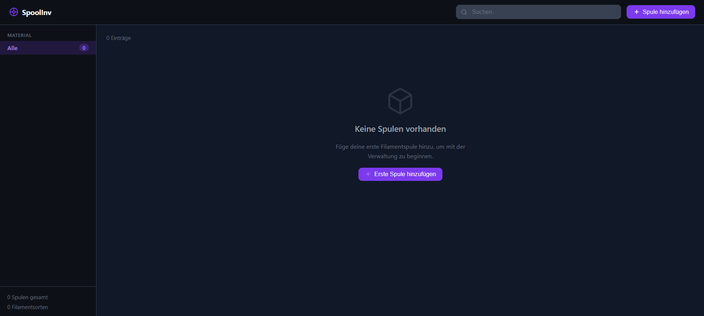
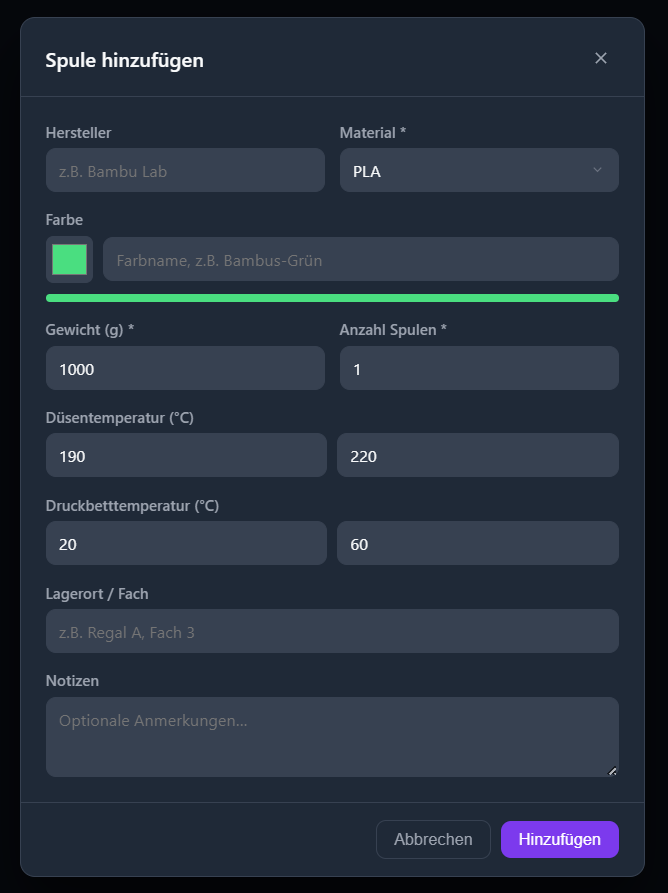

# 🧵 SpoolInv

**3D-Druck Filament Inventarverwaltung** — Eine selbst gehostete Webanwendung zur Verwaltung deiner 3D-Druck Filamentsammlung.


---

## ✨ Funktionen

- **Vollständiges CRUD** — Filamentspulen hinzufügen, bearbeiten und löschen
- **Echtzeit-Filterung** — Nach Material, Hersteller oder Lagerort filtern
- **Volltextsuche** — Sofortige Suche über alle Spuleneigenschaften
- **Statistik-Dashboard** — Übersicht deiner Sammlung nach Material, Marke und Lagerort
- **13 Materialtypen** — PLA, PLA+, ABS, ASA, PETG, TPU, FLEX, Nylon, PC, HIPS, PVA, CF-PLA und mehr
- **Temperatur-Voreinstellungen** — Automatisch befüllte Düsen- & Druckbett-Temperaturen je Material
- **Persistente Datenspeicherung** — Daten werden in einer einfachen JSON-Datei gespeichert, leicht zu sichern
- **Dunkles Design** — Übersichtliche, responsive Benutzeroberfläche im Dark Theme
- **Docker-Ready** — Ein Befehl zum Deployen, Daten überleben Container-Neustarts

---

## 📸 Screenshots

### Übersicht


### Spule hinzufügen


---

## 🚀 Schnellstart

### Docker (Empfohlen)

```bash
docker compose up -d
```

Fertig. Öffne [http://localhost:3000](http://localhost:3000) im Browser.

Die Daten werden in einem benannten Docker Volume (`spoolinv-data`) gespeichert und überleben Container-Neustarts sowie Updates.

---

### Lokale Entwicklung

**Voraussetzungen:** Node.js 20+

```bash
# Abhängigkeiten installieren
npm install

# Entwicklungsmodus starten (Hot-Reload für Frontend und Backend)
npm run dev
```

- React Frontend: [http://localhost:5173](http://localhost:5173)
- Express API: [http://localhost:3000](http://localhost:3000)

---

### Produktions-Build (ohne Docker)

```bash
npm run build
npm start
```

Der Server läuft standardmäßig auf Port `3000`.

---

## ⚙️ Konfiguration

Alle Einstellungen werden über Umgebungsvariablen vorgenommen:

| Variable   | Standard | Beschreibung                                   |
|------------|----------|------------------------------------------------|
| `PORT`     | `3000`   | Port, auf dem der Express-Server läuft         |
| `DATA_DIR` | `./data` | Verzeichnis, in dem `spoolinv.json` gespeichert wird |
| `NODE_ENV` | —        | Auf `production` setzen für optimierten Build  |

### Beispiel: Eigener Port

```yaml
# docker-compose.yml
services:
  spoolinv:
    build: .
    ports:
      - "8080:3000"        # Extern auf Port 8080 erreichbar
    environment:
      - PORT=3000
    volumes:
      - spoolinv-data:/data
    restart: unless-stopped

volumes:
  spoolinv-data:
```

---

## 🗄️ Datenspeicherung

SpoolInv verwendet eine einzelne JSON-Datei (`spoolinv.json`) — kein Datenbank-Setup erforderlich.

**Speicherort im Docker-Container:** `/data/spoolinv.json`

Datensicherung erstellen:
```bash
docker run --rm -v spoolinv-data:/data -v $(pwd):/backup alpine \
  cp /data/spoolinv.json /backup/spoolinv-backup.json
```

---

## 🧱 Tech-Stack

| Schicht    | Technologie                       |
|------------|-----------------------------------|
| Frontend   | React 18, TypeScript, Vite        |
| Backend    | Node.js 20, Express 4, TypeScript |
| Datenbank  | JSON-Datei (keine externe DB)     |
| Container  | Docker, Multi-Stage-Build         |

---

## 📡 API-Referenz

Alle Endpunkte haben das Präfix `/api`.

| Methode  | Endpunkt            | Beschreibung                  |
|----------|---------------------|-------------------------------|
| `GET`    | `/api/spools`       | Alle Spulen abrufen           |
| `GET`    | `/api/spools/stats` | Sammlungsstatistik abrufen    |
| `POST`   | `/api/spools`       | Neue Spule anlegen            |
| `PUT`    | `/api/spools/:id`   | Bestehende Spule aktualisieren|
| `DELETE` | `/api/spools/:id`   | Spule löschen                 |

### Spulen-Objekt

```json
{
  "id": 1,
  "manufacturer": "Prusament",
  "material": "PLA",
  "color_name": "Galaxy Black",
  "color_hex": "#1a1a2e",
  "weight_g": 1000,
  "quantity": 2,
  "nozzle_temp_min": 190,
  "nozzle_temp_max": 220,
  "bed_temp_min": 20,
  "bed_temp_max": 60,
  "location": "Regal A",
  "notes": "",
  "created_at": "2024-01-15T10:00:00.000Z",
  "updated_at": "2024-01-15T10:00:00.000Z"
}
```

---

## 📁 Projektstruktur

```
SpoolInv/
├── src/
│   ├── server/              # Express-Backend
│   │   ├── index.ts         # API-Routen
│   │   └── database.ts      # JSON-Dateipersistenz
│   └── renderer/            # React-Frontend
│       └── src/
│           ├── App.tsx       # Hauptansicht (Raster, Sidebar, Filter)
│           ├── App.css       # Alle Styles
│           ├── api.ts        # Fetch-Client
│           ├── components/
│           │   ├── SpoolCard.tsx    # Einzelne Spulenkarte
│           │   └── SpoolModal.tsx   # Hinzufügen-/Bearbeiten-Formular
│           └── types/
│               └── filament.ts      # Interfaces & Materialkonstanten
├── Dockerfile
├── docker-compose.yml
└── package.json
```

---

## 🤝 Mitmachen

Pull Requests sind willkommen! Bei größeren Änderungen bitte zuerst ein Issue öffnen, um das Vorhaben zu besprechen.

1. Repository forken
2. Feature-Branch erstellen: `git checkout -b feature/mein-feature`
3. Änderungen committen: `git commit -m 'Feature hinzufügen'`
4. Branch pushen: `git push origin feature/mein-feature`
5. Pull Request öffnen

---

## 📄 Lizenz

[MIT](LICENSE) — Copyright © 2026 Niklas Preis

---

## 🤖 Erstellt mit Claude Code

Dieses Projekt wurde mit Unterstützung von [Claude Code](https://claude.ai/code), dem KI-gestützten Programmierassistenten von Anthropic, erstellt.
